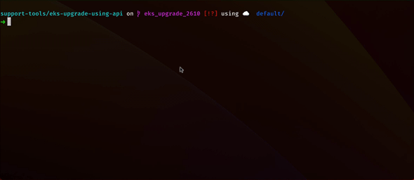

# SURE-5880 Support Script

## Purpose

This script is designed to be used to upgrade EKS clusters using the Rancher API. Its been specifically designed for Rancher v2.6.10 and upgrading EKS clusters from 1.22 to 1.23 (whilst a UI issue prevents this).

## Requirements

This script requires the following:

- jq
- cURL
- Rancher API Endpoint
- Rancher API Token

## Demo



## Usage

1. Create an API key in Rancher.The key can be scoped per cluster or with no scope. Its easier to have no scope as you can use the same API key for all cluster upgrades.
  2. Note down the **Bearer Token** API key
  3. Note down the API Endpoint
2. Open a terminal
3. Export environment variables for the key and endpoint

```bash
export RANCHER_TOKEN="<YOUR BEARER TOKEN FROM ABOVE>"
export RANCHER_API="<YOUR RANCHER API ENDPOINT>"
```

4. Get a list of your EKS clusters using this command

```bash
# For v2
./eks-support.sh list -t $RANCHER_TOKEN --endpoint $RANCHER_API
# For v1
./eks-support.sh list -t $RANCHER_TOKEN --endpoint $RANCHER_API --kev1
```

> The output will list all the found EKS clusters with their name, id, current version and state.

5. For each EKS cluster you want to upgrade run the following command:

```bash
# For v2
./eks-support.sh upgrade -t $RANCHER_TOKEN --endpoint $RANCHER_API --from 1.22 --to 1.23 --name richtest1
# For v1
./eks-support.sh upgrade -t $RANCHER_TOKEN --endpoint $RANCHER_API --from 1.22 --to 1.23 --name richtest1 --aws-secret-key "<AWS SECRET FOR CLUSTER>" --kev1
```

> Replace the values of --from, --to and --name with your values.

6. The cluster will start to upgrade. You can check the status of a specific cluster using this command:

```bash
./eks-support.sh status -t $RANCHER_TOKEN --endpoint $RANCHER_API --name richtest1
```
